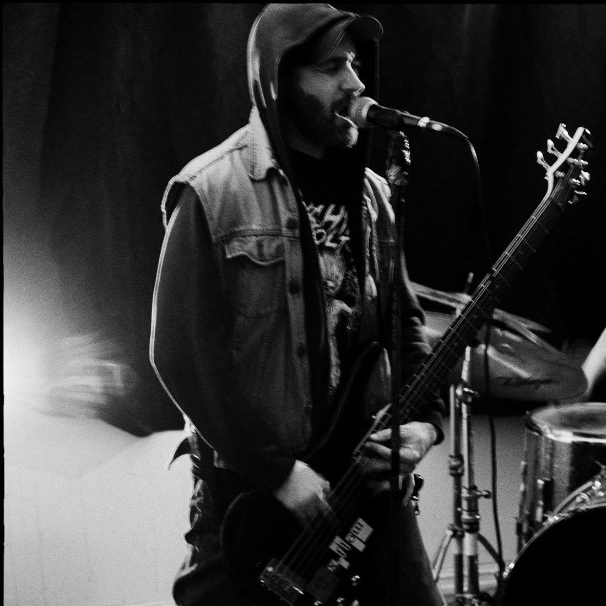

# Sergi Saldaña-Massó

A wandering spirit drawn to the edges of art, nature, and technology, I am an interdisciplinary artist, forest beekeeper, and eco-driven technologist building resilient, mycelium-inspired data ecosystems.  
My journey began with sound—over 30 years as a musician—and grew into a deep dive into digital realms, from early CD-ROM development in the 90s to today’s decentralized networks.  
Formally trained in sound engineering and art direction, I have woven diverse experiences into a practice rooted in ecological stewardship and transparent collaboration.

## **Seigr - Eco-Driven Tech**

Currently, my focus is on [Seigr](https://github.com/Seigr-lab/Seigr-EcoSystem), an ambitious project under the Seigr-lab organization.  
Seigr is a symbiotic, eco-inspired decentralized data ecosystem designed to harmonize technology with nature's adaptive intelligence.  
Inspired by mycelium networks, it aims to create sustainable, self-healing, and ethical data architectures that function like natural ecosystems—capable of growth, resilience, and healing.  

Join us at [Seigr-lab on GitHub](https://github.com/Seigr-lab) to learn more and contribute to a new vision of ethical and eco-driven tech.

---

## **Music Projects – A Journey Through Sound**

For over three decades, sound has been my medium of exploration—shaping raw noise, melodies, and sonic landscapes across different genres and eras.  
From the visceral energy of early underground bands to the more intricate layers of experimental soundscapes, my musical path has been one of collaboration, evolution, and relentless curiosity.

Below is a list of some of the projects I have played in, collaborated with, or continue to be part of—a fragmented map of the sonic territories I’ve traversed.

### **🎵 Music Projects**

- [94 by (Linn Halvorsrød live at Støy på landet 2015)](https://youtu.be/eeyHPOj9x-s?si=23Pm9WvaR0i8GgJO)
- [Axiom Of Choice](https://axiomofchoice.bandcamp.com/)
- [AWSER DERF](https://awserderf.bandcamp.com/)
- [Birds In Misery](https://birdsinmisery.bandcamp.com/)
- [Cide](https://youtu.be/80qKyDir9T4?si=pvUZni1MewfeKiwF)
- [El Próximo Paso](https://elproximopaso.bandcamp.com/)
- [Enlil](https://archive.org/details/abdicate_cell017)
- Furamass
- [G.I.D.](https://antsyrecords.bandcamp.com/track/three)
- [Gob Of Spit](https://archive.org/details/ac004gob)
- [Grela](https://youtu.be/OcqOoT0E3wc?si=KAqOhRE2xxcmKDyI)
- [H: U.N.D.](https://antsyrecords.bandcamp.com/album/arnak-signals-re-master)
- [Hello Friend](https://youtu.be/3Z1Q6-y-ar0?si=gB0SHdYZJ0i3sygu)
- [Insomnia](https://insomniasounds.bandcamp.com/album/live-at-multino)
- [Larsgården/Saldaña](https://archive.org/details/abdicate_cell018)
- [Lystdrap](https://youtu.be/6fpYj6vyHxc?si=A92GxaknRV3qRfCZ)
- [Mantis Crème](https://archive.org/details/abdicate_cell?and%5B%5D=creator%3A%22mantis+cr%C3%A8me%22)
- [Monochrome Nausea](https://monochromenausea.bandcamp.com/)
- Necropsia
- [Norma Vik](https://antsyrecords.bandcamp.com/album/normal)
- [Ormr](https://ormr.bandcamp.com/)
- Parafernalia
- Physis
- [Pit-Roig](https://pit-roig.bandcamp.com/)
- Replica
- Resolving The Dase Case
- [Rituell Romfart](https://youtu.be/vQxaYp7wYKk?si=s5wmKO90bQv1c4xV)
- [Serps](https://serps.bandcamp.com/)
- [Sprøstekte Oscillatorer](https://antsyrecords.bandcamp.com/album/elektrisk-motstand)
- Svovel i Sørpe
- [The Old Slither And The Teeth Possessor](https://antsyrecords.bandcamp.com/album/hyphens)
- [Ursimass](https://ursimass.bandcamp.com/album/batzacs)
- [Wolf And The Gang](https://youtu.be/_WcWt3DADhg?si=wXvKJLbc7TjFGe5H)
- [X-flow](https://archive.org/details/abdicate_cell?and%5B%5D=creator%3A%22x-flow%22)

---

## **🌿 Connect with Me**

🎵 **Antsy Records:** [Antsy-Records](https://antsyrecords.bandcamp.com)
🌎 **Website:** [sergism.com](https://sergism.com)  
🐙 **GitHub:** [sergism77](https://github.com/sergism77)  
🌍 **Seigr Lab:** [Seigr-lab](https://github.com/Seigr-lab)  

---

 <!-- Ensure you upload this image to GitHub -->
